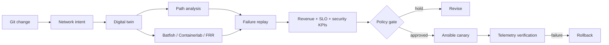

# A2Z Network Change Intelligence Twin

## Artificial Intelligence, Network Automation, Cloud Networking, Network Security, Cisco, Fortinet, Microsoft Azure, AWS, Google Cloud, Kubernetes, DevOps, Infrastructure as Code, Ansible, Digital Twin and Observability

**Compile a proposed network change into reachability, performance, resilience, security and revenue evidence before touching production.**

Most network automation accelerates configuration delivery. This project asks the harder question: should the change be delivered at all?

The executable vertical slice models a BGP preference change across a branch, Azure, AWS and an Apache CloudStack private cloud. The baseline satisfies the revenue-path intent. The proposed change shifts traffic onto an unencrypted, high-latency, high-egress path, so the system returns `hold` before production.

> Claim boundary: this release performs deterministic graph replay over a synthetic topology. Vendor devices, cloud tenants, Batfish, Containerlab, NetBox and production Ansible execution were not operated.

## Run

```bash
PYTHONPATH=src python3 -m unittest discover -s tests -v
PYTHONPATH=src python3 -m netchange.cli \
  examples/multicloud-bgp-change.json \
  --output generated/multicloud-bgp-change
```

Current evidence:

- 6 passing tests;
- baseline business intent passes;
- unsafe BGP preference change is blocked;
- encryption and latency regressions are explicit;
- two dependency-failure scenarios are replayed;
- `$43,200` modeled revenue exposure;
- `$29,900` modeled net validation value after disclosed cost;
- deterministic receipt `d245f9c94c801180608eb265e0f5b80cb7c081404ffdafd785183837f41d76c3`.

These economics are synthetic planning assumptions, not avoided customer losses.

## Architecture



See the [architecture and integration boundaries](docs/architecture.md).

## Comprehensive KPIs

The scorecard contains 25 KPIs across business value, change reliability, latency, bandwidth, packet loss, jitter, convergence, encryption, segmentation, compliance, MTTD, MTTR, human effort, automation coverage, IaC and cloud egress.

The fixture intentionally retains gaps in intent compliance, failure replay, change success, latency, packet loss, configuration compliance, automation and IaC. Hard authority stays outside the AI reasoning layer.

## OSS foundation

- deterministic Python graph engine with no runtime dependencies;
- Containerlab and FRRouting lab contract;
- Batfish and NetBox adapter boundaries;
- Ansible read-only precheck and rollback capture;
- OPA/Rego change gate;
- Azure Bicep telemetry evidence plane;
- JSON decision, KPI and receipt artifacts;
- MIT-licensed project foundation.

See [search and role positioning](docs/search-positioning.md). Exact search-volume figures are not fabricated.

## Work with A2Z SOC

Need to reduce network-change risk across data centers, AI factories, Azure, AWS, Google Cloud, Kubernetes or private cloud? **[Request a Network Change and Revenue Assurance Assessment](https://a2zsoc.com).**
