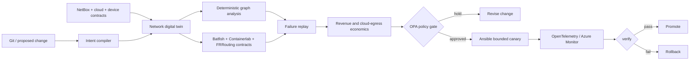

# Architecture and evidence boundary

The Python engine is implemented. Batfish, NetBox, vendor devices, cloud APIs and production Ansible mutation are integration contracts. Containerlab configuration is checked in but requires container images and privileges not exercised by this release. The Azure Bicep deploys only an optional telemetry evidence plane.

## Supported target domains

- Cisco IOS/IOS-XE/NX-OS, Arista EOS, Juniper Junos and Fortinet FortiOS adapter contracts;
- BGP, OSPF, EVPN/VXLAN, SD-WAN, DNS, firewall, load-balancer and QoS intent;
- Azure Virtual Network, Virtual WAN, ExpressRoute and Private Link;
- AWS VPC, Transit Gateway and Direct Connect;
- Google Cloud VPC, NCC and Interconnect;
- Apache CloudStack advanced networking;
- Kubernetes, Cilium, ingress, service mesh, RoCE, RDMA, InfiniBand and NCCL-aware paths.

Only the generic graph and BGP preference scenario are executable today. The remaining domains are roadmap contracts and cannot be described as tested integrations.
